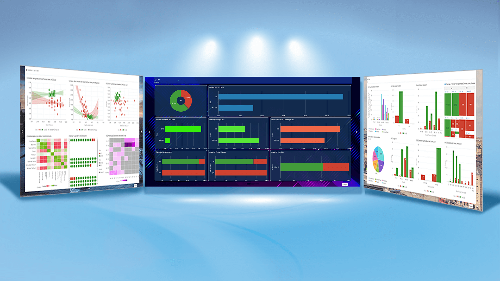
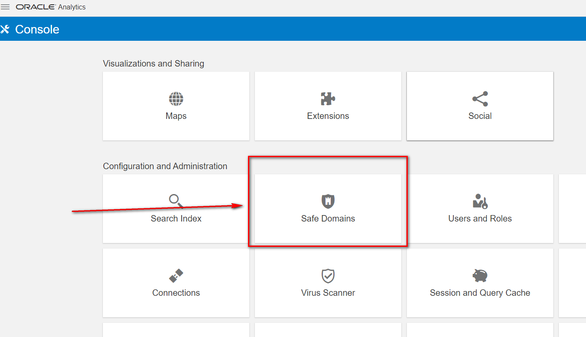
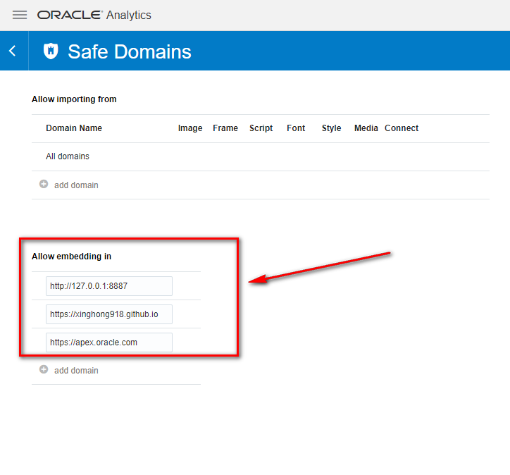
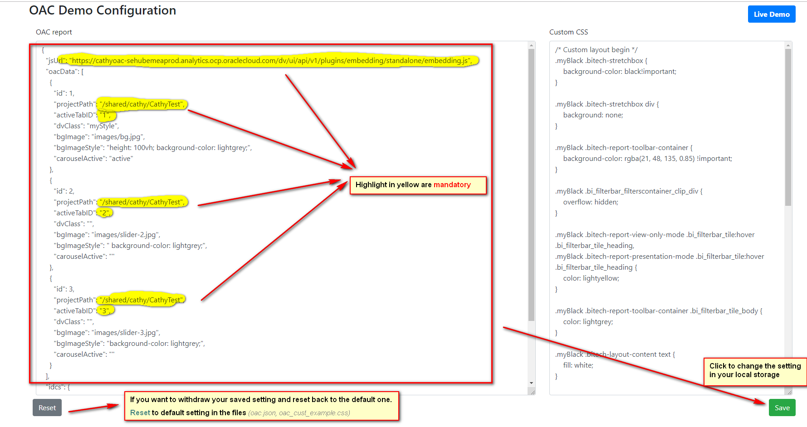
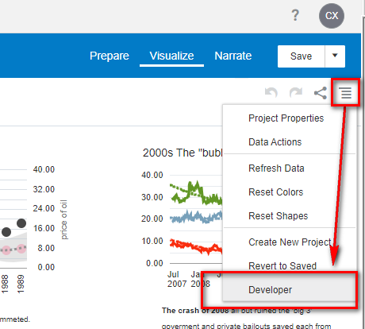
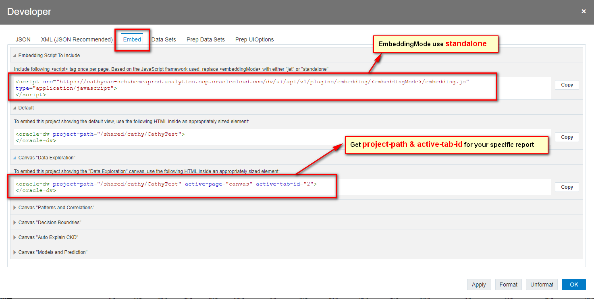
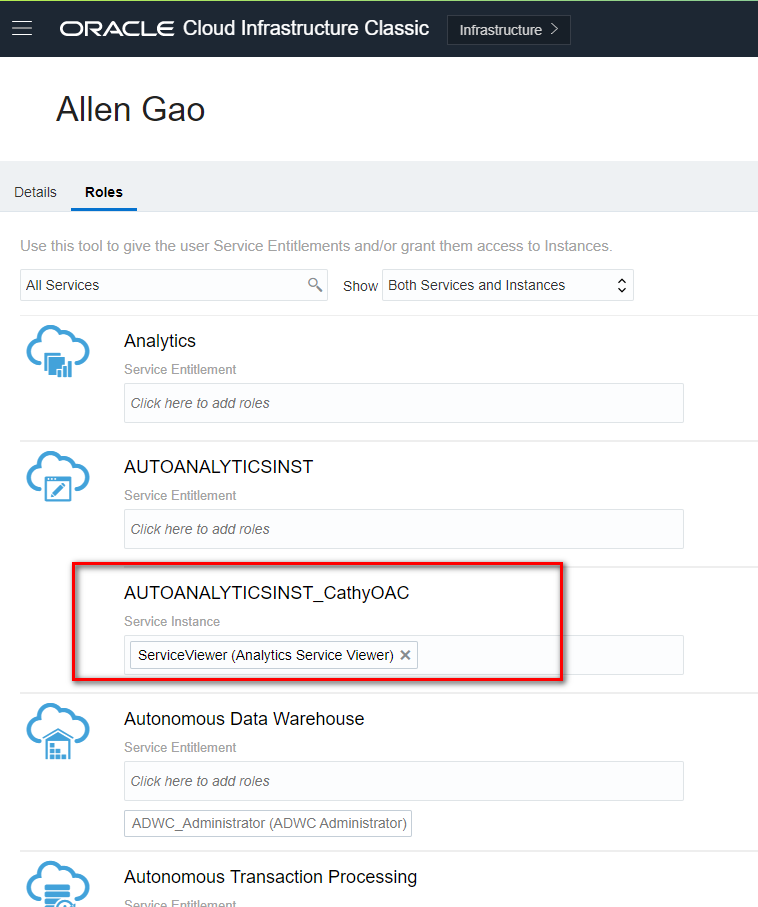

 
 # OAC Web Demo
 ### This is a reuse framework for Embedded OAC Web Application
>This demo doesn't integrate with IDCS, you need to login first and then manually refresh the [oac.html](oac.html). But if you want to share with others, you may need to 

### You can go ahead to the [Live Demo](oac.html) directly.

### Or you can customize it to your OAC report canvas. Just 2 steps for your OAC report to be a web application enablement.

-------------
#### Step by step guide as following:
1. **OAC -> Safe Domains -> Add to "Allow Embedding in" list**
    
    

-------------
2. **Change the setting [from config.html page](config.html)**.
    
    The default settings are from [oac.json](oac.json) file
    
    **Embedding js url & project-path & active-tab-id are mandatory**. You can get them from OAC _(check the screenshots below)_.
        
    
    You can get the info from OAC:
        
        

-------------
3. **If you want to share your report with others, make sure they have granted the role(Service Viewer) to your OAC service instance**
    

-------------
4. **For advanced user, you can also customize the css layout if you want by editing the "Custom CSS" part and then save to apply the new layout**
    

    The default css style example is from [oac_cust_example.css](css/oac_cust_example.css) file
